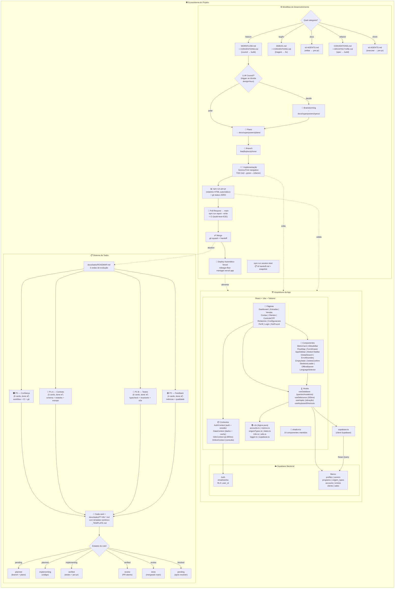
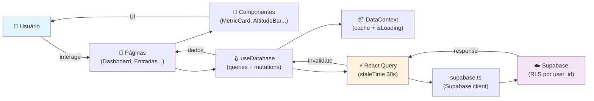
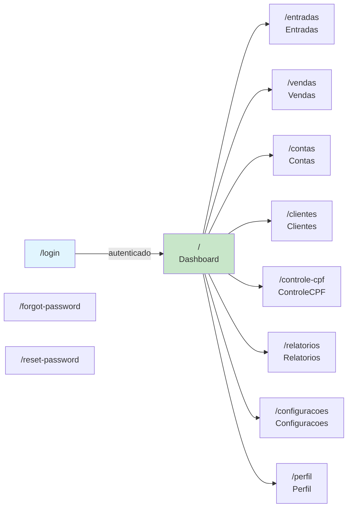

# Fluxograma do Projeto — MilesControl

> Diagrama geral do ecossistema: desenvolvimento + arquitetura + task system.
> Gerado em 2026-07-22.

## Visão Geral

## Fluxo de Dados na App

## Rotas da App

## Navegação Rápida

| Documento | Conteúdo | Link |
|-----------|----------|------|
| WORKFLOW-MANIFEST.md | Fonte canônica do workflow | [docs/WORKFLOW-MANIFEST.md](WORKFLOW-MANIFEST.md) |
| WORKFLOW.md | Detalhamento council-to-superpowers | [docs/WORKFLOW.md](WORKFLOW.md) |
| ARCHITECTURE.md | Estrutura de pastas e dados | [docs/ARCHITECTURE.md](ARCHITECTURE.md) |
| ROADMAP.md | Task cards por onda | [docs/tasks/ROADMAP.md](tasks/ROADMAP.md) |
| MAP.md | Mapa completo do projeto | [docs/MAP.md](MAP.md) |

---

*Diagrama gerado para visão geral do ecossistema MilesControl.*
