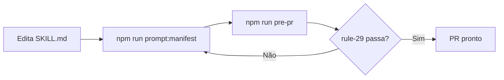

# Prompt Versioning — Design Spec

> Hash automático + manifesto para versionamento de prompts e skills

## 1. Problema

Prompts de skills (`.pi/skills/*/SKILL.md`) e documentos de configuração do agente (`AGENTS.md`, `CLAUDE.md`) são alterados frequentemente, mas **não há rastreabilidade** sobre quais versões foram usadas em quais sessões. Isso causa:

- Impossibilidade de reproduzir sessões antigas
- Dificuldade em debugar regressões ("essa skill funcionava antes, o que mudou?")
- Ausência de proteção contra alterações acidentais em prompts críticos

## 2. Solução

Criar um **manifesto de hashes SHA256** (`.prompts-manifest.json`) que registra o hash de cada arquivo de prompt/skill. Uma **rule de validação** no pre-pr check verifica se toda modificação em arquivos monitorados atualizou o manifesto.

### Arquivos monitorados

```
.pi/skills/*/SKILL.md        (4 skills atuais)
AGENTS.md
CLAUDE.md
docs/CONTEXT-MANAGEMENT.md
docs/WORKFLOW-MANIFEST.md
docs/WORKFLOW.md
```

Novos skills adicionados ao projeto automaticamente viram entradas no manifesto.

### Arquivo manifesto: `.prompts-manifest.json`

```json
{
  "version": 1,
  "updatedAt": "2026-07-28T00:00:00.000Z",
  "prompts": {
    ".pi/skills/council-to-superpowers/SKILL.md": "sha256-a1b2c3...",
    ".pi/skills/handoff/SKILL.md": "sha256-d4e5f6...",
    ".pi/skills/llm-council/SKILL.md": "sha256-g7h8i9...",
    ".pi/skills/small-model-execution/SKILL.md": "sha256-j0k1l2...",
    "AGENTS.md": "sha256-m3n4o5...",
    "CLAUDE.md": "sha256-p6q7r8...",
    "docs/CONTEXT-MANAGEMENT.md": "sha256-s9t0u1...",
    "docs/WORKFLOW-MANIFEST.md": "sha256-v2w3x4...",
    "docs/WORKFLOW.md": "sha256-y5z6a7..."
  }
}
```

## 3. Arquitetura

### 3.1 Scripts

| Script | Função |
|--------|--------|
| `scripts/prompt-manifest.mjs` | Gera/atualiza `.prompts-manifest.json` — lê todos os arquivos monitorados, calcula SHA256, salva manifesto |
| `scripts/rules/rule-29-prompt-version.mjs` | Valida que arquivos modificados vs. manifesto estão atualizados. Falha se hash differe sem manifesto atualizado |

### 3.2 Fluxo



### 3.3 Regra de validação (rule-29)

1. Lê `.prompts-manifest.json`
2. Lê `git diff --name-only HEAD` ou arquivos na working tree
3. Para cada arquivo modificado que está no manifesto:
   - Calcula SHA256 do arquivo atual
   - Compara com hash no manifesto
   - Se diferente → erro: "Arquivo X foi modificado mas manifesto não foi atualizado. Execute: npm run prompt:manifest"
4. Se arquivo novo no diretório monitorado não está no manifesto → warning (mas não blocking)

### 3.4 Integração no workflow

- `npm run prompt:manifest` — novo script em `package.json`
- `npm run pre-pr` — já chama `rule-29-prompt-version.mjs` automaticamente (via loop de rules)
- Adicionar no `check:fast` como etapa opcional de verificação

## 4. Critérios de Aceite

- [ ] `npm run prompt:manifest` gera `.prompts-manifest.json` com hashes corretos
- [ ] Modificar um SKILL.md sem rodar manifest → pre-pr falha com erro claro
- [ ] Rodar manifest após modificação → pre-pr passa
- [ ] Arquivos não monitorados não afetam a validação
- [ ] Script está documentado em `docs/WORKFLOW.md` (seção de scripts)
- [ ] `npm run prompt:manifest` adiciona ao git staging o manifesto atualizado

## 5. Não Escopo

- Versionamento de versões específicas de prompts (só validação de mudança)
- Integração com GitHub tags
- CI check (fica para fase posterior)
